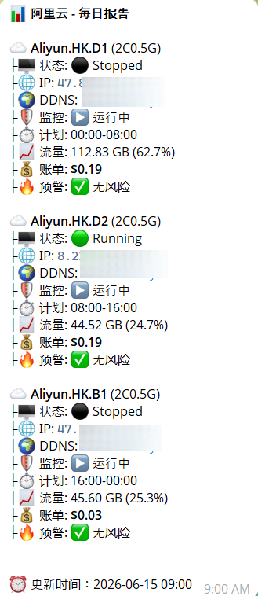

# 阿里云 CDT 流量监控 & 自动止损脚本 (支持国内/国际双版本)


一个不仅为自定义 **Alpine** 系统准备的，更全面支持 **阿里云国内版（人民币结算）** 与 **阿里云国际版（美元结算）** 的 **CDT 公网流量监控 + 自动止损工具**。  
在流量或账单即将失控前 **强制节省停机**，全面适配多节点区域及 Python 3.12 兼容性问题，真正帮你守住钱包 💰。

> 本项目基于 [10000ge10000/aliyun_monitor](https://github.com/10000ge10000/aliyun_monitor) 修改。

---

## ✨ 核心特性

- 🌍 **双轨支持**：完美支持中国内地账单系统（￥）与国际账单系统（$）。
- 🛡️ **流量熔断**：默认每 5 分钟检测 CDT 使用量，超过阈值立即以 `StopCharging` 节省停机模式止损。
- ⏱️ **多实例定时计划**：支持给每台 ECS 单独设置每日运行时段，多账号、多服务器可按计划轮流运行。
- 🌍 **Cloudflare DDNS 智能同步**：支持单机或多机共用域名解析，内置**当班实例防抢占保护**、**全局所有权追踪**与**无缝换班延迟停机**机制。
- 💵 **底层双端兼容**：绕过 API 限制，动态适配业务节点读取当月实时账单余额。
- 🚀 **防黑洞卡死机制**：内置 SNI 与 IPv6 黑洞自动绕过补丁，保障常驻任务在高延迟或 Python 3.12+ 环境下稳定运行。
- 🔄 **自动恢复**：次月流量重置后自动开机恢复业务。
- 📊 **多账号多地域**：同时监控任意组合（不同账号、不同区域、不同内外版实例）。
- 📩 **Telegram 通知**：异常监控告警 + 每日图文并茂的汇总日报，暂停监控时仍会展示完整状态、流量与账单。
- 🤖 **Telegram 机器人管理**：支持菜单化查看实例、开机、节省停机、重启、查询状态、修改定时窗口，并可随时获取当前日报内容。

---

## ⭐ 运行截图

<div align="center">
  
  <br>
  <p><i>运行效果预览</i></p>
</div>

---

## 🛠️ 前置准备

### 1️⃣ Telegram 通知参数
- 创建机器人并获取 Token：[@BotFather](https://t.me/BotFather)
- 获取您接收消息的 Chat ID：[@userinfobot](https://t.me/userinfobot)

### 2️⃣ 阿里云 RAM 权限设置
为了安全起见，**强烈建议不要使用主账号**。请前往阿里云 RAM 访问控制台创建子用户并授予系统权限：
- 🇨🇳 **国内版 RAM 权限设置入口**：👉 [点击进入阿里云国内站 RAM 控制台](https://ram.console.aliyun.com/users)
- 🌐 **国际版 RAM 权限设置入口**：👉 [点击进入阿里云国际站 RAM 控制台](https://ram.console.alibabacloud.com/users)

需要授予的安全权限：
- `AliyunECSFullAccess`（含开关机与查询权限）
- `AliyunCDTReadOnlyAccess` 或 `AliyunCDTFullAccess`（查询流量）
- `AliyunBSSReadOnlyAccess`（查询财务与账单模块）

*(若需要了解详细的创建与使用流程，请查阅本项目内的 [实例开通指南](实例开通.md))*

---

## （一） Alpine Linux（VNC）初始化（可选，针对底层系统玩家）

> ⚠️ **如果您是普通的 Linux (如 Ubuntu/Debian) 用户，请直接跳过本节至 "(三) 一键安装"，本节仅适用于脱水版 Alpine 系统。**

1. 登录阿里云实例的 **VNC 控制台**
2. 复制本项目中 `vnc.sh` 的全量内容。您可以直接一键复制执行以下命令来获取：
前往 GitHub 仓库直接打开 [vnc.sh](https://raw.githubusercontent.com/EmmaHermione/aliyun_monitor/refs/heads/main/tools/vnc.sh) 复制源码全文
3. 将代码 **完整粘贴到 VNC 界面并回车执行**。
4. 初始完毕后即可按以下默认信息 SSH 远程登录：
   - **用户名**：`root`
   - **初始化密码**：`yiwan123`

## （二） Alpine 修复 GRUB 引导并重装 Debian 13 (可选扩展)

> 适用于 **系统无法启动 / GRUB 损坏 / Debian 无法进入** 等进阶场景。通过 **Alpine Linux + chroot** 的方式修复引导并重装 Debian 13。

使用 **root 用户** 登录 Alpine 后，下载并执行脚本：
```bash
wget -qO- https://raw.githubusercontent.com/EmmaHermione/aliyun_monitor/refs/heads/main/tools/install2.sh | sh
```

---

## （三） 一键安装与配置监控 (所有适用者推荐)

使用 **root 用户** 在任意连通互联网的 Linux 服务器或所监控的 ECS 本机上执行：

```bash
wget -O aliyun-monitor.sh https://raw.githubusercontent.com/EmmaHermione/aliyun_monitor/refs/heads/main/aliyun-monitor.sh
bash aliyun-monitor.sh
```

脚本将提供丝滑的交互式配置，自动：
* 检测并修齐 Python 运行微环境与 Pip 依赖。
* 拉取已深度解除底层网关 Bug 的执行组件。
* 引导您录入 Telegram 配置、选择站别类型（人民币或美元账单）、输入并配置多个待监控账号。
* 为每个实例单独设置可选的每日运行时段，用于多账号、多服务器按定时计划使用 CDT。
* 为每个实例单独设置可选的 Cloudflare DDNS，同步当前 Running 实例的公网 IP。
* 设置系统计划任务（Cron），按 **5 分钟/次** 及每天早 9 点执行巡检与汇报。
* 配置 Telegram Bot 远程管理入口，发送 `/menu` 即可打开管理菜单。

> 提示：如果日后需要增加、删除机器、修改实例基础配置、更新脚本、重启 Bot 或调整定时窗口，只需再次运行该脚本命令即可进入管理面板。

---

## ⏱️ 多实例定时计划

本项目支持给每台 ECS 实例单独设置每日运行窗口。该功能适合多账号、多服务器按定时计划使用阿里云 CDT，例如多台服务器分时运行，避免所有实例同时在线。

运行窗口是 **实例级配置**，不限制实例数量。添加 2 台、3 台或更多服务器时，每台都会按照自己配置的 `schedule_start` 和 `schedule_end` 独立执行。

### 工作方式

安装脚本仍然只写入一个全局巡检任务：

```cron
*/5 * * * * /opt/scripts/venv/bin/python /opt/scripts/monitor.py >> /opt/scripts/monitor.log 2>&1 #aliyun_monitor
```

`monitor.py` 每 5 分钟运行一次，并逐个读取 `/opt/scripts/config.json` 中的实例配置：

- 当前时间在该实例的计划时段内：执行流量与账单止损逻辑，流量和账单均安全则启动或保持运行，任一项超标则调用 ECS `StopInstance` 并指定 `StoppedMode=StopCharging`。
- 当前时间不在该实例的计划时段内：如果实例正在运行，则自动以 `StopCharging` 节省停机；如果已经停止，则保持停止状态。
- 未启用计划时段的实例：保持原来的全天监控行为。

计划时间使用服务器本地时间。请先确认服务器时区，例如中国时间应为：

```bash
timedatectl
timedatectl set-timezone Asia/Shanghai
```

### 安装时配置

添加实例时，脚本会提示：

```text
是否启用该实例的定时运行窗口? (y/n, 默认 n):
开始时间 HH:MM:
结束时间 HH:MM:
```

安装时也会提示设置账单止损阈值。该值以美元为基准，默认 `1`；国内人民币账单会自动按约 7 倍换算，即默认超过约 `¥7` 触发账单预警与节省停机。

时间会保存为标准 `HH:MM` 格式，例如：

```text
00:00
08:30
13:00
23:59
```

输入时也支持 `0:00`、`9:05` 这类简写，脚本会自动补齐为 `00:00`、`09:05`；`24:00` 会按午夜处理并保存为 `00:00`。

支持跨天窗口，例如 `20:00-08:00` 表示晚上 20:00 开始运行，第二天早上 08:00 结束。

### 多台服务器示例

3 台服务器每天分 3 段运行：

| 实例 | 运行时段 |
| --- | --- |
| Server-A | `00:00-08:00` |
| Server-B | `08:00-16:00` |
| Server-C | `16:00-00:00` |

2 台服务器各运行 12 小时：

| 实例 | 运行时段 |
| --- | --- |
| Server-A | `00:00-12:00` |
| Server-B | `12:00-00:00` |

对应配置字段示例：

```json
{
  "name": "Server-A",
  "schedule_enabled": true,
  "schedule_start": "00:00",
  "schedule_end": "12:00"
}
```

### 后续修改

重新运行安装脚本，检测到已有配置后会进入管理面板：

```text
实例管理：
1) 查看实例状态 (List)
2) 添加实例 (Add)
3) 修改实例配置/DDNS (Edit)
4) 修改运行窗口 (Schedule)
5) 暂停/恢复监控 (Pause/Resume)
6) 删除实例 (Delete)

系统维护：
7) 更新脚本并重启服务 (Update)
8) 重新初始化配置 (Reset Config)
9) 卸载并清理脚本 (Uninstall)
0) 退出 (Exit)
```

选择 `1) 查看实例状态 (List)`，可以只读查看实例 ID、区域、暂停状态、运行窗口和 DDNS 配置。

选择 `3) 修改实例配置/DDNS (Edit)`，即可修改已有实例的备注名、AccessKey ID、AccessKey Secret、账号类型、ECS Region、ECS 实例 ID、流量节省停机阈值、账单止损阈值和 Cloudflare DDNS 配置。每个字段直接回车会保持原值，只输入需要修改的内容即可。

选择 `4) 修改运行窗口 (Schedule)`，即可为已有实例开启、关闭或修改运行窗口。

选择 `7) 更新脚本并重启服务 (Update)` 会从远程仓库拉取最新的 `monitor.py`、`report.py`、`bot.py`、`ddns.py` 和当前目录下的 `aliyun-monitor.sh`，重启 Telegram Bot 服务，但不会修改 `/opt/scripts/config.json`。更新完成后脚本会自动进入新版管理菜单。

选择 `8) 重新初始化配置 (Reset Config)` 才会重新进入完整配置流程，并覆盖现有 `/opt/scripts/config.json`。这是危险操作，请确认已备份配置后再执行。

也可以直接编辑 `/opt/scripts/config.json`：

```json
"schedule_enabled": true,
"schedule_start": "00:00",
"schedule_end": "12:00"
```

注意：如果多个实例时间段重叠，它们会同时运行；如果时间段之间有空档，空档期间没有实例运行。

---

## 🌍 Cloudflare DDNS 智能解析

本项目支持给每台 ECS 实例单独配置 Cloudflare DDNS，支持单实例独立绑定域名，也全面支持**多实例轮换共用同一域名**的进阶场景。

### 核心特性与工作机制

1. **当班保护优先（防抢占机制）**：
   - 当多台实例配置了相同的 DDNS 域名时，若当前有合法的**在班实例**（处于自身计划时段且 `Running`），通过 Telegram Bot 手动开机或在计划外启动其他实例时，系统将**自动跳过 DDNS 抢占**，并在 Telegram 中回显 `DDNS: 已跳过 (当班实例 [xxx] 正在使用该域名)`，避免误将域名指向非当班机器。
   - 若当班实例处于停止或异常状态，其他正在运行的实例可自动接管同步该域名，保障业务解析不中断。

2. **全局域名所有权追踪与秒级自愈**：
   - 系统在状态缓存中全局维护每个 DDNS 域名的归属者与 IP（`ddns_records`）。
   - 一旦域名在外部被修改或因应急接管发生转移，合法在班实例在下一次 5 分钟巡检中能秒级识别归属不一致，立刻修正回自身 IP，彻底杜绝“因本地 IP 未变而误判无需同步”的问题。

3. **无缝换班保护与延迟停机**：
   - 换班时，只有接班实例已进入 `Running` 且 DDNS 同步成功或无需更新后，窗口外的旧实例才会按计划节省停机。
   - 接班实例就绪后，旧实例还会额外延迟数分钟（`DDNS_HANDOFF_LINGER_SECONDS = 240`）再节省停机，等待全球 DNS 缓存平滑过期。

### 同步时机

* 自动巡检发现实例需要恢复运行，并确认已进入 `Running` 后。
* 实例已在运行窗口内且保持 `Running` 时，按冷却周期或全局归属变动检查公网 IP，避免重复调用 Cloudflare。
* Telegram Bot 手动开机后，确认实例进入 `Running` 且通过当班冲突校验时。

同步顺序：

```text
确认实例 Running
校验当班所有权 (非当班且存在在班实例则跳过)
获取 ECS 公网 IP
查询 Cloudflare DNS 记录
IP 不一致则更新，一致则跳过
更新全局 DDNS 归属状态
Telegram 通知回显 DDNS 结果
```

实例配置字段示例：

```json
"ddns_enabled": true,
"ddns_provider": "cloudflare",
"ddns_token": "Cloudflare API Token",
"ddns_zone_id": "Cloudflare Zone ID",
"ddns_record_name": "hk.example.com",
"ddns_record_type": "A"
```

第一版仅支持 Cloudflare `A` 记录。`ddns_token` 建议使用 Cloudflare API Token，并授予对应 Zone 的 DNS 编辑权限。

如果多台实例配置同一个域名，建议运行窗口不要重叠（例如 `00:00-12:00` 与 `12:00-00:00`），系统将按照定时时段全自动无缝轮换。

---

## 🤖 Telegram Bot 远程管理

安装完成后，在 Telegram 中向您的机器人发送：

```text
/menu
```

即可打开实例管理菜单。主菜单会列出所有 ECS 实例，并提供 `📊 获取报告` 按钮。选中某台实例后，Bot 会直接展示该实例的状态、规格、IP、运行计划、流量、账单与预警信息。状态图标会区分停机模式：`⚫ Stopped` 表示节省停机，`🔴 Stopped` 表示普通停机。

选中某台实例后，可以执行：

- `🟢 开机`
- `🔴 节省停机`
- `🔁 重启`
- `✏️ 修改定时`
- `🗑 删除定时`
- `⏸️ 暂停/恢复监控`
- `🧹 清除手动覆盖`

点击 `✏️ 修改定时` 后，Bot 会等待您输入新的开始时间和结束时间。直接发送：

```text
08:00 20:00
```

即可把所选实例的运行窗口修改为 `08:00-20:00`。如果时间格式输错，可以直接重新输入，格式必须为 `HH:MM HH:MM`。

也可以直接使用命令：

```text
/menu
/list
/report
/status 机器名或序号
/start 机器名或序号
/stop 机器名或序号
/reboot 机器名或序号
/schedule 机器名或序号 HH:MM HH:MM
/unschedule 机器名或序号
/clearoverride 机器名或序号
```

其中 `/report` 会立即生成并发送当前日报内容，与每天定时发送的日报使用同一套统计逻辑。日报状态图标同样会区分停机模式：`⚫ Stopped` 表示节省停机，`🔴 Stopped` 表示普通停机；运行中显示 `🟢 Running`。

通过 Bot 手动开机或重启会设置 `manual_override=run`，巡检会在流量和账单安全时保持该实例运行，即使当前不在定时窗口内。手动节省停机会设置 `manual_override=stop`，巡检会保持停机，即使当前处于定时窗口内。

手动覆盖不会绕过流量或账单止损；任一阈值超标时仍会优先节省停机。需要恢复按定时计划自动接管时，点击 `🧹 清除手动覆盖`，或发送 `/clearoverride 机器名或序号`。

---

## ⏸️ 暂停/恢复某台机器的监控

当某台机器处于特殊状态（例如安全锁定、维护或暂不希望自动开机/节省停机）时，可以临时暂停监控：

1. 重新运行安装脚本进入管理面板。
2. 选择 **“暂停/恢复监控实例 (Pause/Resume)”**。
3. 选择目标机器（如 `HK-02`）即可切换暂停/恢复状态。

暂停后：
- `monitor.py` 将跳过该机器的自动巡检动作，不会自动开机或自动节省停机。
- `report.py` 和 Telegram Bot 查询仍会正常读取实例状态、IP、流量、账单与预警信息。
- 日报会额外显示 `🛡️ 监控: ⏸️ 已暂停`；恢复后显示 `🛡️ 监控: ▶️ 运行中`。

---

## 👋 卸载

```bash
wget -O uninstall.sh https://raw.githubusercontent.com/EmmaHermione/aliyun_monitor/refs/heads/main/uninstall.sh
bash uninstall.sh
```

---

## ⚠️ 免责声明

1. 本项目仅供学习与技术交流使用。
2. 虽然我们尽力适配和兜底了绝大部分的系统、网络、API 阻断与连接层 BUG，但**作者不对因脚本异常、API 变更、依赖挂除或配置错误导致的任何流量流失及费用直接负责。**
3. **强烈建议同时在阿里云费用中心后台设置「预算告警 / 垫底限额」作为最后的防线。**

---

## ⭐ 欢迎 Star 支持

如果这个项目帮您梳理了多节点的部署或者成功避免了一次“破产”，欢迎点个 ⭐！你的支持是我们持续维护的动力 🙏
